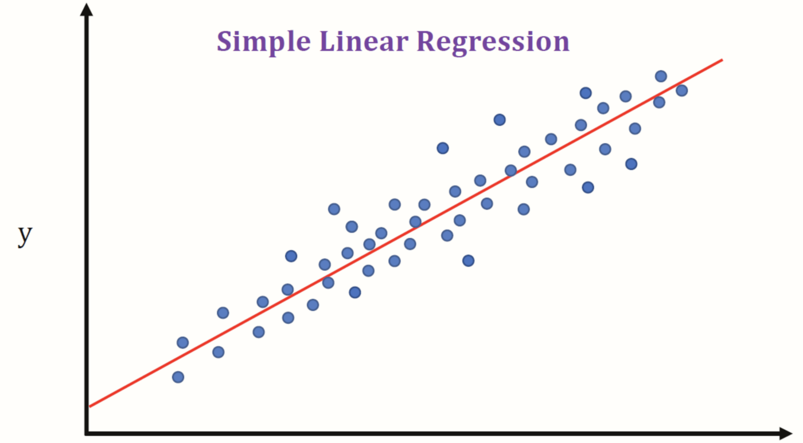

# SIMPLE LINEAR REGRESSION ANALYSIS

**Task 1:** 

Simple linear regression analysis.

## Problem Statement

<b>Predict the percentage of an student based on the numbers of study hours.</b>

## Dataset Name

student_scores - student_scores.csv

## Column Description

Independent Variable : **Hours** (Number of hours student has studied in a day)

Target Variable : **Scores** (Percentage of marks obtained by the student corresponding to the number of study hours he has studied)

## Predicting the score if a student studies for 9.25 hrs/ day?

No of Hours = 9.25

Predicted Score = 94.77111221192709
